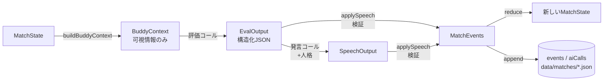

# アーキテクチャ

## ディレクトリ構成とモジュール責務

```
ai-buddy-werewolf/
├── apps/
│   ├── web/          # 検証UI (React + Vite)。ゲームロジックを一切持たない
│   └── server/       # APIサーバー + CLI。設定読込・セッション管理・永続化・HTTP
├── packages/
│   ├── shared/       # 共通型・Zodスキーマ・シード付き乱数(依存なし)
│   ├── game-core/    # 純粋TSのゲームロジック(React/ブラウザAPI/LLM非依存)
│   └── ai-engine/    # LLMプロバイダー抽象化・評価/発言コール・モックAI・進行ランナー
├── config/           # ルール・役職・助言・能力アンロック・モデル/単価(バージョン付き)
├── prompts/          # Live AI用プロンプト(評価/発言/役職別) + version.json
├── data/             # 試合データ(JSON, gitignore)
└── docs/
```

依存方向(逆流禁止):

```
apps/web ──(HTTP + 型のみimport)──▶ apps/server ──▶ ai-engine ──▶ game-core ──▶ shared
```

| モジュール | 責務 | 持たないもの |
|---|---|---|
| `shared` | 型・Zodスキーマ・`rand(seed, ...labels)` | 状態・I/O |
| `game-core` | 状態(`state.ts`)・ルール計算(`rules.ts`)・エンジン(`engine.ts`)・可視性(`visibility.ts`) | LLM・HTTP・ファイルI/O・UI |
| `ai-engine` | プロバイダー(`mock.ts`/`anthropic.ts`)・プロンプト組み立て・コール記録(`calls.ts`)・進行(`runner.ts`) | ルール判定(必ずengineを通す) |
| `apps/server` | 設定/プロンプトの読込と編集・`MatchManager`(セッション+永続化)・HTTPルーター・CSV・CLI | ゲームルール |
| `apps/web` | 画面のみ。`@aibw/*` からは**型だけ**をimport | 判定ロジック |

## ゲーム状態遷移

```mermaid
stateDiagram-v2
    [*] --> day_start : createMatch(役職配布)
    day_start --> discussion : advance(ポリシー主人の助言注入)
    discussion --> discussion : ai_speech(評価→発言) × 生存者×周回
    discussion --> trial : 発言キュー消化
    trial --> trial : 主人の意思表示を収集(人間は待つ/他はポリシー)
    trial --> night : ai_votes(並列評価→補正→投票→処刑) 勝敗未決
    trial --> finished : 勝敗決定
    night --> day_start : ai_night(占い+襲撃統合) 勝敗未決
    night --> finished : 勝敗決定 or 最大日数
    finished --> [*]
```



進行は**プル型**: `getPendingTask(state)` が次にやるべき1単位(`ai_speech` / `wait_inputs` / `ai_votes` / `ai_night` / `advance_day` / `finished`)を返し、`MatchRunner.advanceOnce()` がそれを実行する。クライアントは「進める」/自動ループで advance を叩くだけで、人間の入力が必要なときは `waiting` が返る。

## データフロー(1回の発言ステップ)



重要な原則:

- **AI出力は「提案」**であり、`engine.ts` の `apply*` 関数が検証してイベント化するまで状態に触れない(不正な対象IDは除去・拒否される)
- **状態変化はすべてイベント**(`MatchEvent`)として記録され、`rebuildState(events)` でいつでも復元できる(= リプレイ/巻き戻しの根拠)。テストで「実行時状態 == 再構築状態」を保証している
- 乱数は `rand(seed, ...ラベル)` で**呼び出し順に依存せず**導出するため、同シードなら同結果(モック時)

## AI評価コールと発言コールの違い

| | 評価コール (evaluate) | 発言コール (speak) |
|---|---|---|
| 目的 | 内部状態の更新(怪しい度・襲撃優先度・仮説・投票候補) | 円卓での公開発言文の生成 |
| 出力 | **Zod検証付き構造化JSON**(`EvalOutput`) | `{text, accusesId}` |
| 人格 | **含めない**(判断と表現の分離) | 含める(口調・語尾・長さ) |
| 実行 | **並列可**(裁判・夜は全員分を `Promise.all`) | **逐次**(前の発言を聞いて次が話す) |
| CoT | 保存しない(短い `reasonSummary` のみ) | — |

先行生成への備え: 評価と発言は疎結合で、評価結果(`eval_recorded`)は公開ログの時点に紐づいて保存される。助言で未来の発言が無効になっても、過去ログに対する評価は再利用できる(Phase0では先行生成自体は未実装)。

## 秘密情報の分離

LLMに渡してよい情報は `game-core/visibility.ts` の **`buildBuddyContext(state, pairId)`** が唯一の生成点。ここを通らないプロンプト組み立ては禁止。

- 含まれる: 公開ログ / 自分の役職 / 狼仲間(狼のみ) / **共有済み**確定情報 / 自分の主人の助言 / 自分の能力・人格 / 自分の過去評価
- 含まれない: 他組の役職 / 未共有の占い結果 / 他の主人の助言 / 他AIの内部スコア / GM役職表 / シード(将来の乱数結果)

イベントには `visibility`(`public` / `gm` / `pairs+part(master|buddy|both)`)が付き、占い結果は `part: 'master'` で**主人だけ**に届く。`canSeeEvent` と `buildMasterView` が視点別ビューを作る。漏えいは `packages/game-core/test/visibility.test.ts` の自動テストで検出する。

## LLMプロバイダー抽象化

`ai-engine/provider.ts` の `LlmProvider` インターフェース(`evaluate` / `speak`)に対し、

- `MockProvider`: シード決定論的なヒューリスティックAI(APIキー不要)
- `AnthropicProvider`: Anthropic Messages API(構造化出力 + SDKタイムアウト/リトライ)

を実装。プロバイダー追加は `config/models.json` に定義を足し、`calls.ts` の `createProvider` に分岐を1つ足すだけ。API仕様(エンドポイント・構造化出力・usage取得)は `anthropic.ts` に閉じている。

`AiEngine.run` が全コール共通で「レイテンシー・トークン・原価(単価×トークン)・リトライ・JSON失敗・エラー」を `AiCallRecord` に記録し、失敗時は**モックへ決定論的フォールバック**する。

## 永続化とリプレイ

- 保存先: `data/matches/<matchId>.json`(スキーマ = `MatchRecord`: メタ + `configSnapshot`(設定・プロンプトバージョン込み) + `events` + `aiCalls`)
- 書き込みは advance/操作のたびに非同期チェーンで実施(一時ファイル→rename)
- エクスポート: `GET /api/matches/:id/export`(JSON) / `export.csv?type=evals|calls`(CSV)
- リプレイ: `buildReplayData(state, events)` がGM専用イベント(評価スナップショット・補正詳細・襲撃統合)から時系列データを組み立てる。試合終了まで(Labフラグなしでは)取得できない
- 巻き戻し: `rewindToPhaseStart` がイベント列を最後の `phase_changed` まで切り詰め、`rewound` イベントでnonceを上げる(モックの再実行結果を変えたい場合に備えた仕組み)

## 将来スマホアプリへ移植する際の方針

- `game-core` / `shared` はブラウザ・Node両対応の純TSなので、React Native / 別WEBフロント / サーバーサイドからそのまま利用できる
- Flutterなど非JSクライアントへは、`apps/server` のHTTP APIをそのままバックエンドとして使う(ビュー = `MasterView` が既にクライアント非依存のJSON)
- UIを作り直しても `MatchRunner` / `MatchManager` は再利用できる。リアルタイム化する場合はポーリングをSSE/WebSocketに替えるだけでよいよう、状態は常にサーバー側が正
- LLM呼び出しは必ずサーバー側(APIキー保護)。この境界は本番でも維持する
