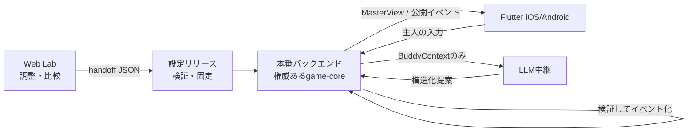

# 本番モバイルへの持ち越し契約

## 目的

Web Labで調整したルール、能力、人柄、モデル設定、プロンプトを、試行時点の**再現可能な1リリース**として本番モバイル実装へ渡す。画面の見た目をコピーするための形式ではなく、「どの条件・どの文章でゲームを動かしたか」を失わずに昇格させるための契約である。

## 書き出し方法

公開Web Labの「設定・プロンプト」→「モバイル引継ぎパッケージを書き出す」を押す。ファイル名は `ai-buddy-mobile-handoff-<promptVersion>.json`。

パッケージには次を含む。

- Quick Test / Pack Testのルール
- 助言メニュー、能力アンロック、バディ人格
- モデルID、推論強度、トークン上限、推定単価
- system / eval / speech / 役職別の全プロンプト
- 全設定バージョン、プロンプトバージョン、書き出し時刻
- `files` 内容のSHA-256と本番実装契約

APIキー、平文の合言葉、ブラウザの試合履歴、ユーザー情報は含まない。

## 固定スキーマ

- TypeScript/Zod: `packages/shared/src/types.ts` の `MobileHandoffBundle` と `packages/shared/src/schemas.ts` の `mobileHandoffBundleSchema`
- JSON Schema: `docs/schemas/ai-buddy-mobile-handoff.schema.json`
- 対象ファイル一覧: `MOBILE_HANDOFF_FILE_PATHS`
- SHA-256入力の正規化: `canonicalizeMobileHandoffFiles(files)`

SHA-256は、パスを昇順に並べ、各要素を `path + NUL + content`、要素間をNULで連結したUTF-8文字列に対して計算する。これは転送中の内容差分を検知するもので、電子署名ではない。第三者配布を取り込む運用へ広げる場合は、署名または信頼済み管理画面からの昇格を追加する。

## 本番の責務境界

本番でも次を守る。

- Flutterは表示と主人入力を担当し、GameStateを権威ある状態にしない
- フェーズ遷移、投票、襲撃、勝敗、秘密可視性はバックエンドの `game-core` を正とする
- LLMへ渡すのは `buildBuddyContext` が作った視点別情報だけ
- AI出力は提案であり、`game-core` が検証してから正式イベントへ反映する
- プロンプトとモデル設定、APIキーはサーバー側。Flutterバイナリへ埋め込まない
- Flutterへ返すのは `MasterView` と、試合終了後に許可されたReplayだけ

既存の純TypeScript `game-core` をDartへ複製するとルール差分と漏えい事故が起きやすい。本番初期はNode/Supabase側で再利用し、FlutterはAPIクライアントにする構成を推奨する。

## 受け入れ手順

1. JSON Schemaまたは `mobileHandoffBundleSchema` で外形を検証する
2. `schemaVersion === 1`、`kind`、13個の固定ファイルパス、`secretsIncluded === false` を確認する
3. `canonicalizeMobileHandoffFiles` と同じ規則でSHA-256を再計算し、`integrity.digest` と一致させる
4. 各 `config/*.json` を既存Zodスキーマで検証し、`prompts/version.json` のversionを読む
5. `releaseId` とdigestを付けた不変リリースとしてサーバー側へ保存する。既存リリースを上書きしない
6. ステージングでモック完走、秘密分離テスト、Liveの評価/発言各1コール、390×844のFlutter画面を確認する
7. 人間が比較実験結果と原価を承認したリリースだけを本番のactive versionへ切り替える
8. ロールバックはactive versionを直前のdigestへ戻す。過去の試合は開始時のdigest/versionを保持する

## 本番へ持ち越すもの／持ち越さないもの

| 持ち越す | 持ち越さない |
|---|---|
| 核4原則、イベント型、秘密境界、設定・プロンプト、能力値、モデル条件、計測定義 | Web Labの合言葉、localStorage、Lab全内部表示、フェーズ巻き戻し権限、デバッグ用生レスポンス |
| 試合開始時の設定スナップショットとdigest | 特定ブラウザの過去試合データ |
| JSON/CSVエクスポート形式（分析用途） | APIキーやSupabase secret |

## 昇格前の必須チェック

- [ ] プロンプトversionと各config versionを意図的に更新した
- [ ] パッケージのZod/JSON Schema検証とSHA-256再計算が成功した
- [ ] `npm test`、`npm run lint`、`npm run build` が成功した
- [ ] モックでQuick TestとPack Testが完走した
- [ ] Live評価/発言のJSON検証・再試行・フォールバックを確認した
- [ ] 占い結果と他主人の助言が別バディのcontextへ漏れない
- [ ] APIキー・合言葉・試合データがbundleへ含まれない
- [ ] 本番Flutterから直接LLMを呼んでいない
